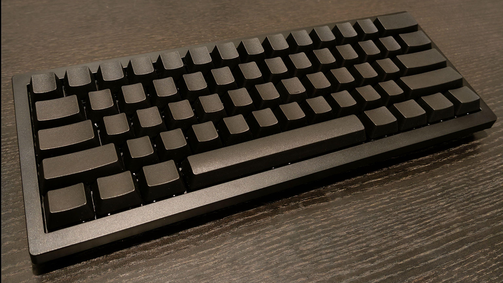
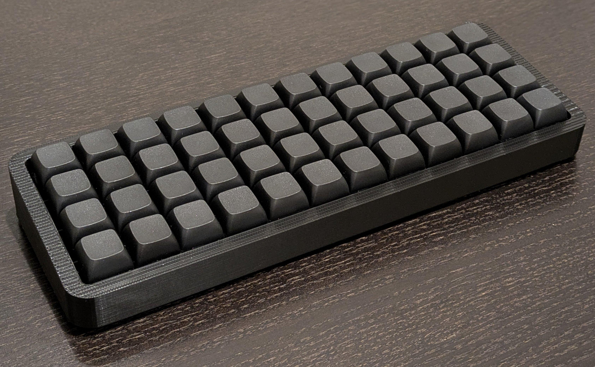
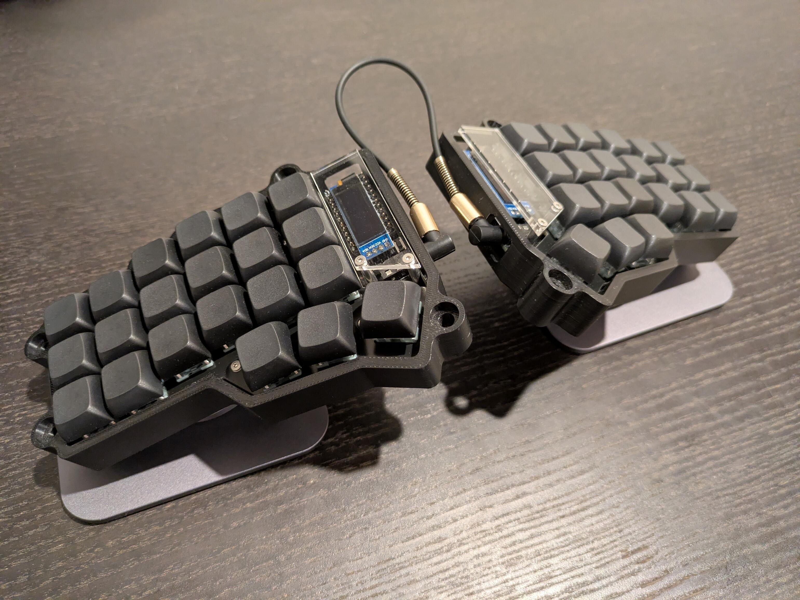
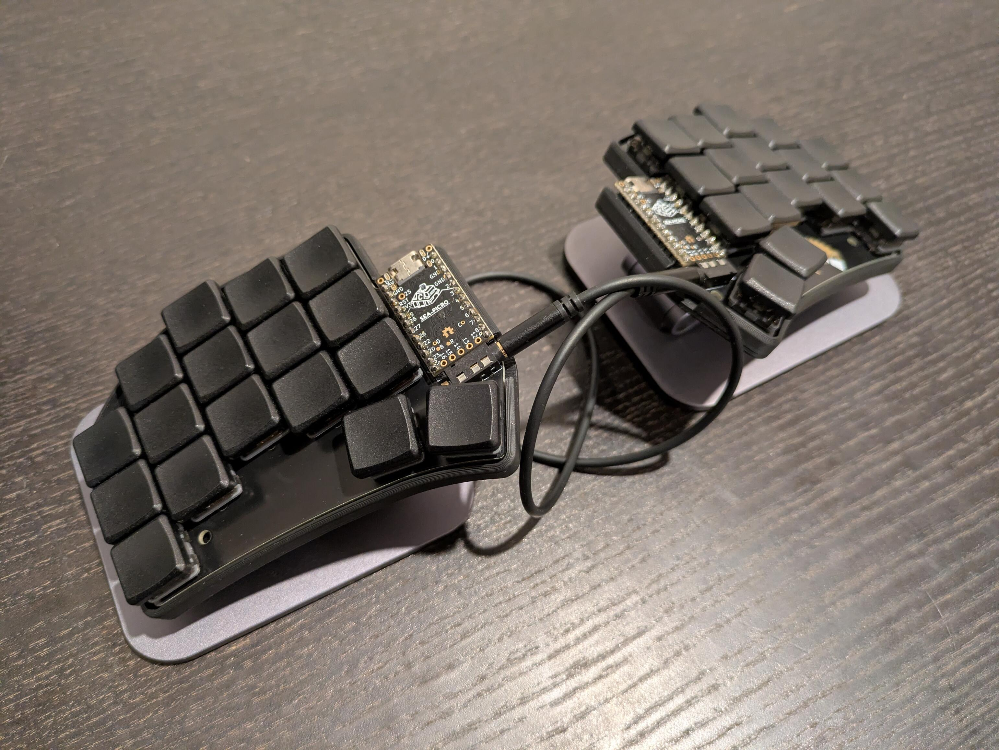

## Notes

Some notes on keyboards I've used, including the motivations for
getting them, comments on setup/use, and things to watch out for.

 * [Summary](#summary)
 * [Keyboards](#keyboards)
    * [Keychron V4](#keychron-v4)
    * [Contra](#contra)
    * [Corne](#corne)
    * [Ferris Sweep](#ferris-sweep)

### Summary

### Keyboards

#### Keychron V4

#### Contra

#### Corne

#### Ferris Sweep

